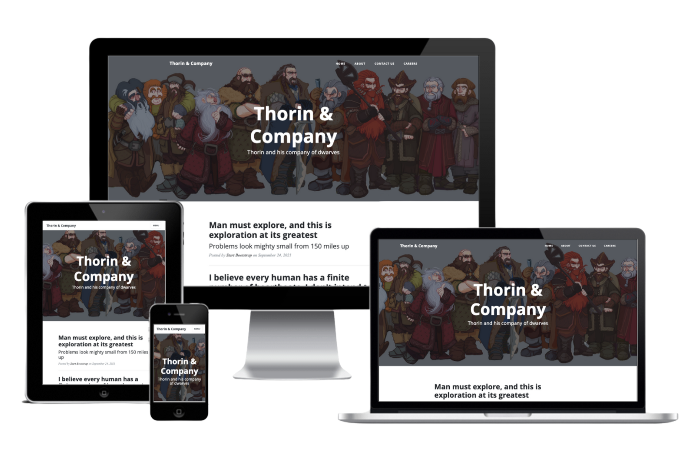

# Code Institute - Thorin & Company Flask Application

This is a solution to the a challenge from the [Code Institute
](https://codeinstitute.net/) Backemd Module to create a flask application. 

## Overview

### The challenge

- 

### Screenshots

- [Mobile]()
- [Desktop]()

### Links

- [Repo](https://github.com/Franciskadtt/thorin-flask-app)
- [Live site](https://thorin-and-company-fdt.herokuapp.com/)

## My process

### Built with

- HMTL
- CSS 
- Javascript
- Python
- MongoDB

### What I learned

### Process

## Coded By
- Website - [Franciska Du Toit](https://franciskadutoit.com/)
- Instagram - [@designed.byfranciska
](https://www.instagram.com/designed.byfranciska/)
- LinkedIn - [@franciskadutoit
](https://www.linkedin.com/in/franciskadutoit/)

## Acknowledgements

- All content and images were provided by [Code Institute
](https://codeinstitute.net/)

